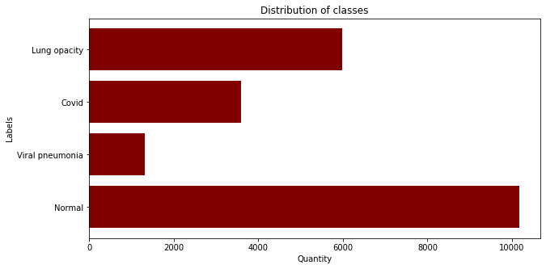
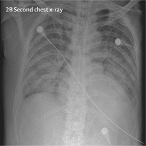
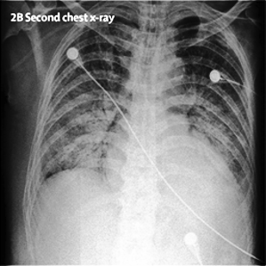
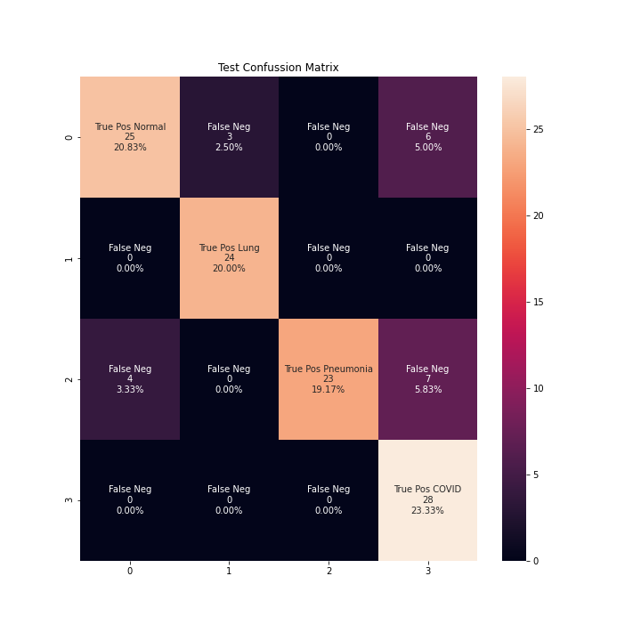
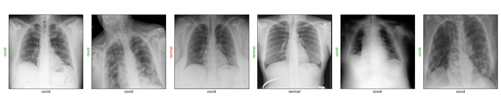
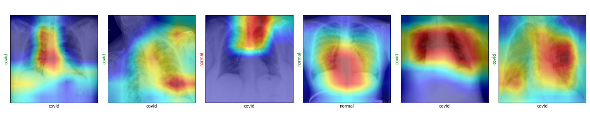

# 🩺 COVID-19 Detection from Chest X-Ray (PyTorch)

Fine-tuned **ResNet-18** on a 4-class chest-X-ray dataset (Normal, Lung-Opacity, Viral-Pneumonia, COVID-19).  
Includes full training notebooks, evaluation metrics, and Grad-CAM visualisation.

---

## 1 Project Motivation
Chest X-ray (CXR) is inexpensive, quick and widely available.  
Accurate automatic classification can support clinicians when PCR tests are slow or unavailable.  
This repo provides a reproducible PyTorch pipeline that achieves **≈95 % training accuracy and 83 % test accuracy** on an open COVID-19 radiography dataset.

---

## 2 Dataset & Pre-processing

* Source: [Kaggle – COVID-19 Radiography Database](https://www.kaggle.com/tawsifurrahman/covid19-radiography-database)  
* Four balanced classes; 30 images per class held out for testing.  
* Total training images: **21 045**

| Class | Train | Test |
|-------|------:|-----:|
| Normal          |  8 000 | 30 |
| Lung Opacity    |  8 000 | 30 |
| Viral Pneumonia |  3 045 | 30 |
| COVID-19        |  2 000 | 30 |

<p align="center">
  
</p>

All CXRs are contrast-stretched before augmentation:

| Before | After CLAHE |
|--------|-------------|
|  |  |

---

## 3 Model & Training

| Setting | Value |
|---------|-------|
| Backbone | **ResNet-18** (ImageNet weights) |
| Augment  | `Resize → RandomHorizontalFlip → Normalize` |
| Loss     | Cross-entropy (class-weighted) |
| Optimizer| Adam, LR 1e-4 |
| Hardware | NVIDIA GPU (notebook also runs on CPU) |

Notebooks:  
* [`1. cpu_training.ipynb`](1.%20cpu_training.ipynb)  
* [`1. gpu_training.ipynb`](1.%20gpu_training.ipynb)

---

## 4 Results

| Metric | Value |
|--------|------:|
| **Train accuracy** | 86.5 % |
| **Test accuracy**  | 83.3 % |
| Macro-F1 (test)    | 0.85 |

Detailed report: [`2. evaluation_metrics.ipynb`](2.%20evaluation_metrics.ipynb)

### Classification Report

| Pathology        | Precision | Recall | F1-Score | Support |
|------------------|---------:|-------:|---------:|--------:|
| Normal           | 0.91 | 0.77 | 0.83 | 26 |
| Lung Opacity     | 0.89 | 1.00 | 0.94 | 33 |
| Viral Pneumonia  | 1.00 | 0.78 | 0.88 | 36 |
| COVID-19         | 0.70 | 0.92 | 0.79 | 25 |

<p align="center">
  
</p>

### Grad-CAM

| Normal | COVID-19 |
|--------|----------|
|  |  |

Red regions highlight where the network focuses when predicting.

---

## 5 How to Run (code)

```bash
# clone
git clone https://github.com/<your-username>/covid-cxr-study.git
cd covid-cxr-study

# install deps
pip install -r requirements.txt

# train (CPU or GPU)
jupyter notebook 1.\ cpu_training.ipynb
# or
jupyter notebook 1.\ gpu_training.ipynb

# evaluate
jupyter notebook 2.\ evaluation_metrics.ipynb